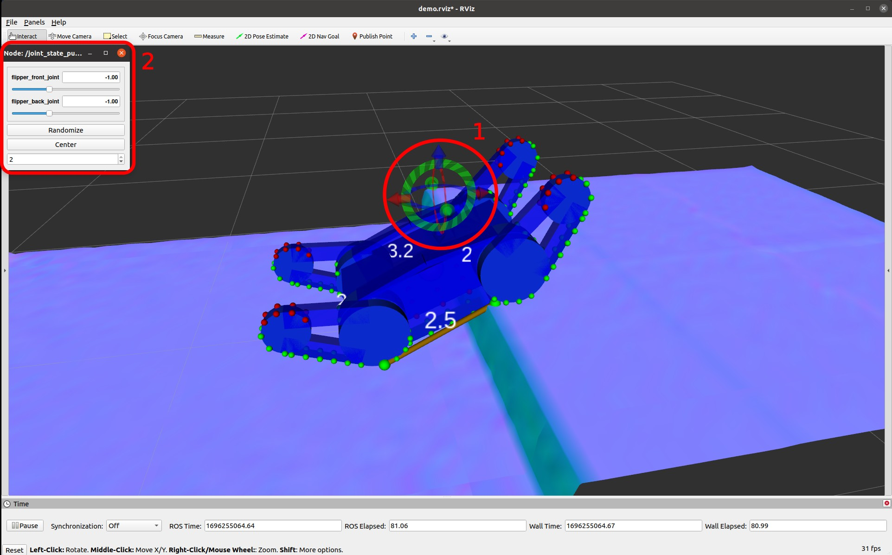
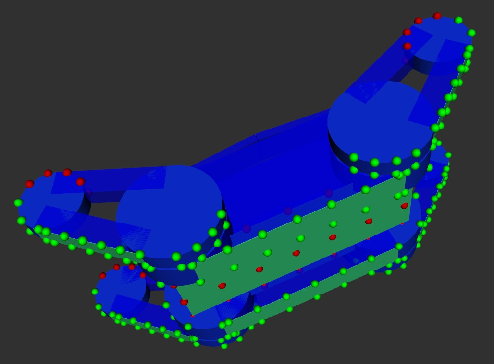

# sdf_contact_estimation
sdf_contact_estimation is a library for [ROS](https://www.ros.org/) for the accurate and fast pose prediction of mobile ground robots in rough terrain using [signed distance fields](https://github.com/ethz-asl/voxblox).

Based on a 2D pose query and the joint configuration, the statically stable 3D pose on the ground as well as contact points and support polygon are computed:

<p align="center">
  
</p>
With a runtime of about 0.5 ms per predicted pose, this approach is much faster than a traditional physics simulation and suitable for online planning applications.

Possible use-cases:

- Automatic flipper control
- Path planning
- Tip-over prevention


A demo launch configuration is available below.

**Author/Maintainer: Martin Oehler<br/>
Affiliation:  [TU Darmstadt, SIM](https://www.sim.informatik.tu-darmstadt.de/)<br/>
License: MIT**

## Installation
If you haven't already installed it, [install ROS](http://wiki.ros.org/noetic/Installation/Ubuntu). Please use **Desktop-Full Install** to run the demo. Noetic is officially supported, but Melodic and Kinetic should work as well.

[Create a new catkin workspace](https://catkin-tools.readthedocs.io/en/latest/quick_start.html). Skip this step if you use your existing workspace. 
```
source /opt/ros/noetic/setup.bash
mkdir -p catkin_ws/src
cd catkin_ws/
catkin init
```

Go into the source directory of your workspace and check out this repository
```
cd src/
git clone https://github.com/tu-darmstadt-ros-pkg/sdf_contact_estimation.git
```

Install dependencies via rosdep and wstool (.rosinstall)
```
cd sdf_contact_estimation
rosdep install --from-paths . --ignore-src -r -y
wstool init ../.. # not required if already initialized
wstool merge sdf_contact_estimation_https.rosinstall
wstool update
```
Build
```
catkin build sdf_contact_estimation_demo
```
and source the workspace
```
source ../../devel/setup.bash
```
Verify your installation by launching the demo (see below).


## Getting started

### Launching the demo
Launch the demo with
```
roslaunch sdf_contact_estimation_demo demo.launch
```
<p align="center">
  
</p>
An rviz window will open (see above), showing the robot model and the environment. Using the interactive marker (1), the pose query can be updated. The robot model visualizes the corresponding statically stable pose on the ground. Additionally, a small rqt window (2) will open with sliders for each joint. These can be used to update the joint configuration.

### Configure your own robot
A good way to get started is modyfing the provided [demo launch](sdf_contact_estimation_demo/launch/demo.launch) to use your own robot. The algorithm requires a robot model provided as an [URDF](http://wiki.ros.org/urdf) and a Signed Distance Field (SDF) environment model provided by [Voxblox](https://github.com/ethz-asl/voxblox). Based on the URDF, contact candidate points need to be defined on relevant surfaces such as tracks and the underside of the chassis. These contact candidates are used to check for collisions against the SDF.

<p align="center">
  
</p>
A simple configuration file could look like this:

```
joints: # Specify joints that effect the collision link transforms
  - flipper_front_joint
  - flipper_back_joint
collision_links: # Specify links that are considered for collision checking
  # Chassis
  - link: chassis_link
    type: body # Optional meta data
    ignore_indices: [1] # Ignore collision bodies of this link for improved performance
  # Main tracks
  - link: main_track_left_link
    type: track
    resolution: &main_track_resolution 0.08 # Sample resolution, edges are always sampled
  - link: main_track_right_link
    type: track
    resolution: *main_track_resolution
  # Flippers
  - link: flipper_front_left_link
    type: track
    resolution: &flipper_track_resolution 0.045
  - link: flipper_front_right_link
    type: track
    resolution: *flipper_track_resolution
  - link: flipper_back_left_link
    type: track
    resolution: *flipper_track_resolution
  - link: flipper_back_right_link
    type: track
    resolution: *flipper_track_resolution
```
Please refer to the [demo configuration](sdf_contact_estimation_demo/config/shape_config.yaml) and the parameter list below for further parameters to tune the behavior and increase performance. 

#### Parameters


### Voxblox
[Voxblox](https://github.com/ethz-asl/voxblox) is a volumetric mapping library based on Signed Distance Fields (SDF). The demo configuration loads an artificial environment for demonstration purposes. On your real robot, you want to create a live SDF based on pointcloud data using the `voxblox_ros/esdf_server` node instead.  Follow the documentation [here](https://voxblox.readthedocs.io/) and [here](https://voxblox.readthedocs.io/en/latest/pages/Using-Voxblox-for-Planning.html) to set up Voxblox for your robot.

### Using the library
The following code snippet illustrates how the sdf_contact_estimation library could be used as part of your project.
```
ros::NodeHandle nh;
ros::NodeHandle pnh("~");

// Set up ESDF server
ros::NodeHandle esdf_server_pnh(pnh, "esdf_server");
auto esdf_server = std::make_shared<voxblox::EsdfServer>(nh, esdf_server_pnh);
// Load map into model
auto sdf_model = std::make_shared<sdf_contact_estimation::SdfModel>(pnh);  
sdf_model->loadEsdf(esdf_server->getEsdfMapPtr(), esdf_server->getEsdfMaxDistance(), false);  

// Create robot model  
ros::NodeHandle shape_model_nh(pnh, "shape_model");  
auto shape_model = std::make_shared<sdf_contact_estimation::ShapeModel>(shape_model_nh);  
  
// Create sdf contact estimation
auto sdf_pose_predictor = std::make_shared<sdf_contact_estimation::SDFContactEstimation>(pnh, shape_model, sdf_model);
```
This model uses an external ESDF server node to transfer the ESDF map as described [here](https://voxblox.readthedocs.io/en/latest/pages/Using-Voxblox-for-Planning.html).

Now the pose and contact estimation can be used as follows

```
```
    
## Benchmarks
### Results

### Running the benchmark

