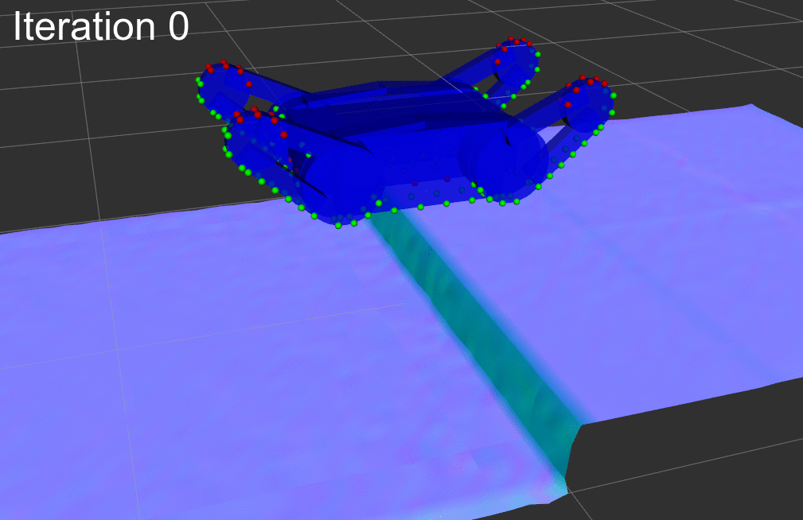

# sdf_contact_estimation
sdf_contact_estimation is a library for [ROS](https://www.ros.org/) for the accurate pose prediction of mobile ground robots in rough terrain based on signed distance fields.

  

Possible use-cases:

- Automatic flipper control
- Path planning
- Tip-over prevention

A demo launch configuration is available below.

**Author/Maintainer: Martin Oehler 
Affiliation:  [TU Darmstadt, SIM](https://www.sim.informatik.tu-darmstadt.de/) 
License: MIT**
